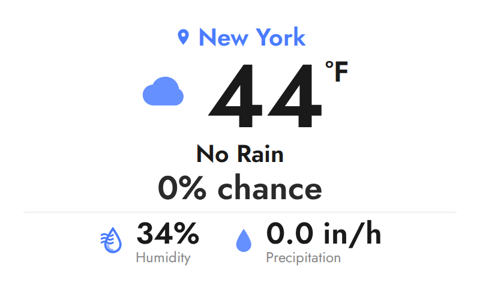
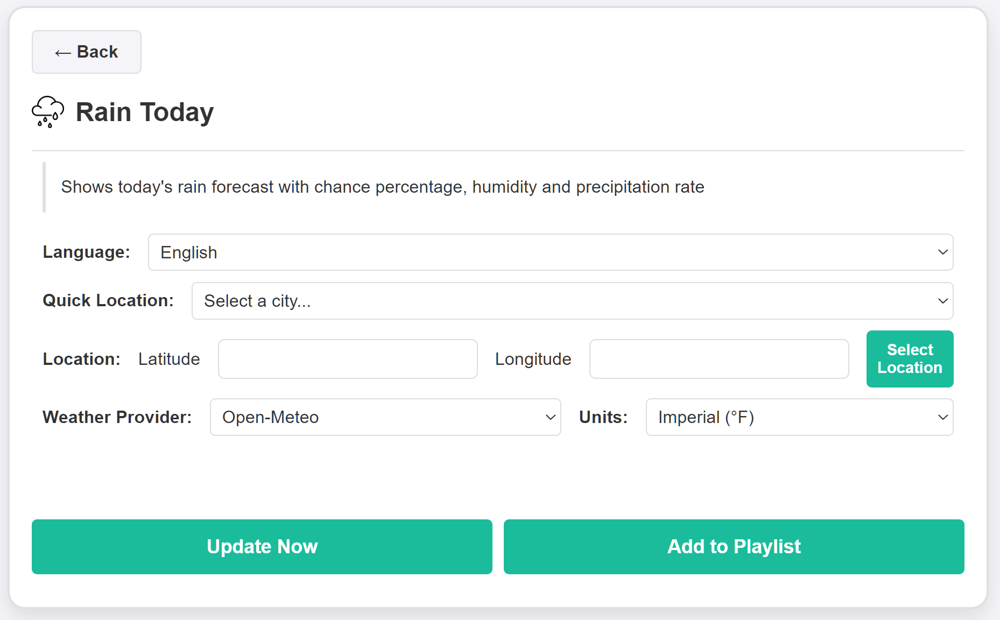

# Rain Today Plugin for InkyPi

A lightweight Rain Today plugin focused on showing today's rain conditions in a simple and clean layout for e-paper displays

Rain Today is **not a full weather plugin**, but a focused alternative designed to quickly show rain information for today, avoiding unnecessary complexity and keeping the UI minimal and readable

## Install

Install the plugin using the InkyPi CLI, providing the plugin ID and GitHub repository URL

```bash
inkypi plugin install rain_today https://github.com/saulob/InkyPi-Rain-Today
```

This plugin is an extension for the InkyPi e-paper display frame and includes the following features

**Features**

- Today's rain forecast
- Rain chance percentage
- Humidity display
- Precipitation rate display
- Simple and clean layout for quick glance
- Multi-language support
- Quick location selection
- Manual latitude and longitude input
- Weather provider support Open-Meteo no API key required
- Unit selection for temperature and precipitation

**Key differences**

Compared to full weather plugins

- Focused only on today's rain
- Minimal layout with no forecast clutter
- Faster setup with fewer settings
- Optimized for readability on e-paper
- No API key required using Open-Meteo

**Settings**

- Language selection
- Quick Location presets or manual latitude and longitude
- Weather provider Open-Meteo
- Unit selection Imperial or Metric

**Notes**

- Uses Open-Meteo free API no key required
- Designed to be simple and fast
- Focused only on today's rain conditions
- Works well on small screens and dashboards

**Screenshots**

- Rain Today widget on the main dashboard
- Plugin settings screen

<p align="center">   </p>

